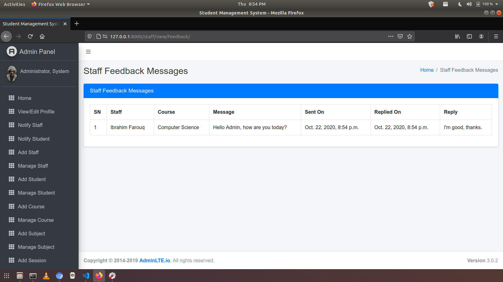
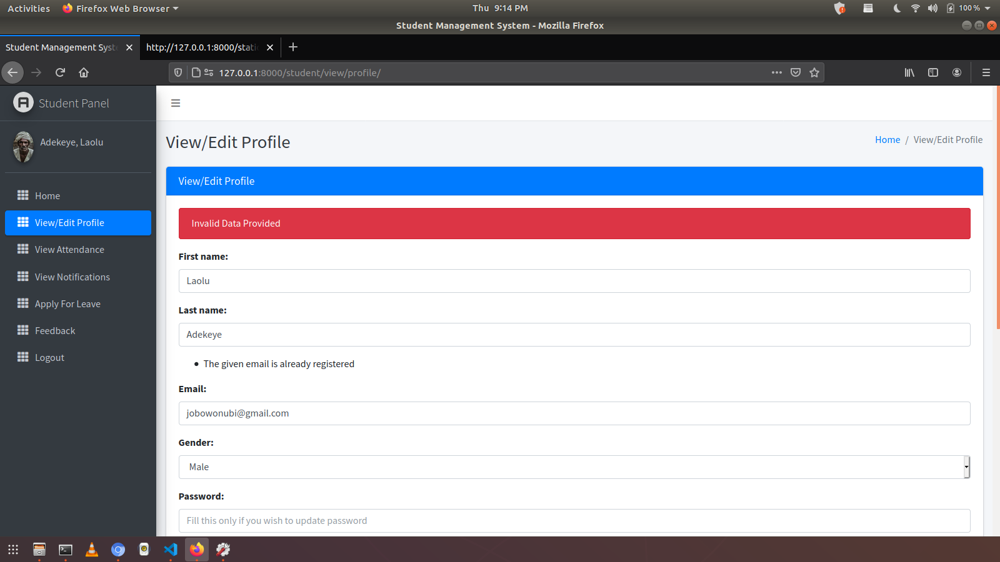
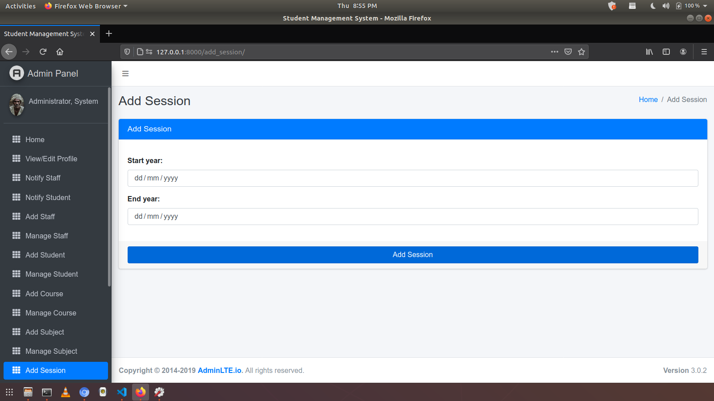
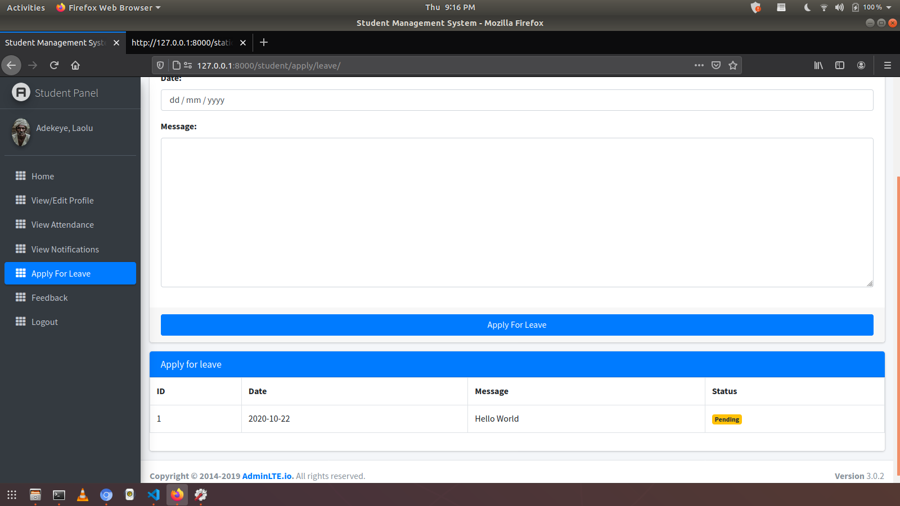
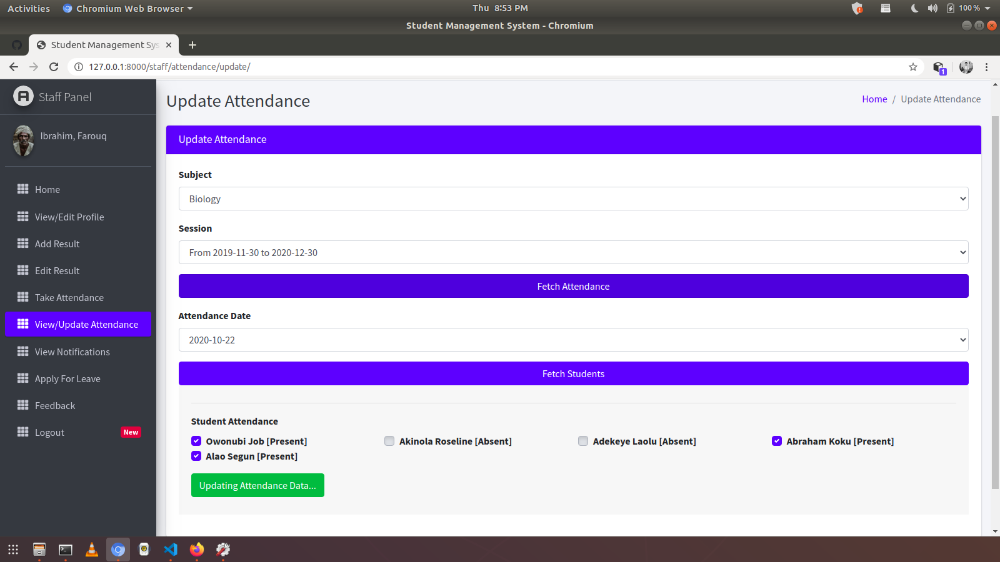

# LearnSphere - Academic Management Platform

A role-based academic management platform built with Python and Django, designed to streamline administrative workflows for institutions with 100+ users across three roles: Admin, Staff, and Students.

## Overview

LearnSphere reduces manual staff data entry by 3-4 hours/week through automated feedback and leave workflows. It provides real-time dashboards for tracking courses, attendance, results, and leave requests across multiple academic data domains.

## Tech Stack

`Python` `Django` `SQLite` `HTML` `CSS` `Bootstrap` `JavaScript`

## Features

### Admin
- View summary dashboards for student performance, staff activity, attendance, and leave
- Manage Staff, Students, Courses, Subjects, and Sessions (Add, Update, Delete)
- Review and approve/reject leave applications from staff and students
- Review and reply to feedback submitted by staff and students

### Staff
- View dashboards for their students, subjects, and leave status
- Take and update student attendance
- Add and update student results
- Apply for leave and send feedback

### Student
- View personal dashboards for attendance, subjects, and leave status
- View attendance records and results
- Apply for leave and send feedback

## Database Design

The platform uses a normalised relational SQLite schema modelling the following entities:

- **Users** - role-based access (Admin, Staff, Student)
- **Courses and Subjects** - hierarchical academic structure
- **Attendance** - session-wise tracking per student
- **Results** - subject-wise performance records
- **Leave** - application and approval workflow
- **Feedback** - two-way communication between roles

## Screenshots

| Admin | Staff | Student |
|-------|-------|---------|
||||
||||
||||
||||
||||
||||

## How to Run Locally

**1. Clone the repository**
```bash
git clone https://github.com/yashm1524/LearnSphere.git
cd LearnSphere
```

**2. Create and activate a virtual environment**
```bash
python -m venv venv

# Windows
source venv/scripts/activate

# Mac/Linux
source venv/bin/activate
```

**3. Install dependencies**
```bash
pip install -r requirements.txt
```

**4. Run migrations**
```bash
python manage.py migrate
```

**5. Create a superuser (Admin)**
```bash
python manage.py createsuperuser
```

**6. Start the server**
```bash
python manage.py runserver
```

Then open `http://127.0.0.1:8000` in your browser.

## Author

**Yash Makvana**
B.Tech CSE, National Institute of Technology Surat
[LinkedIn](https://linkedin.com/in/YashMakvana1524) | [GitHub](https://github.com/yashm1524)
